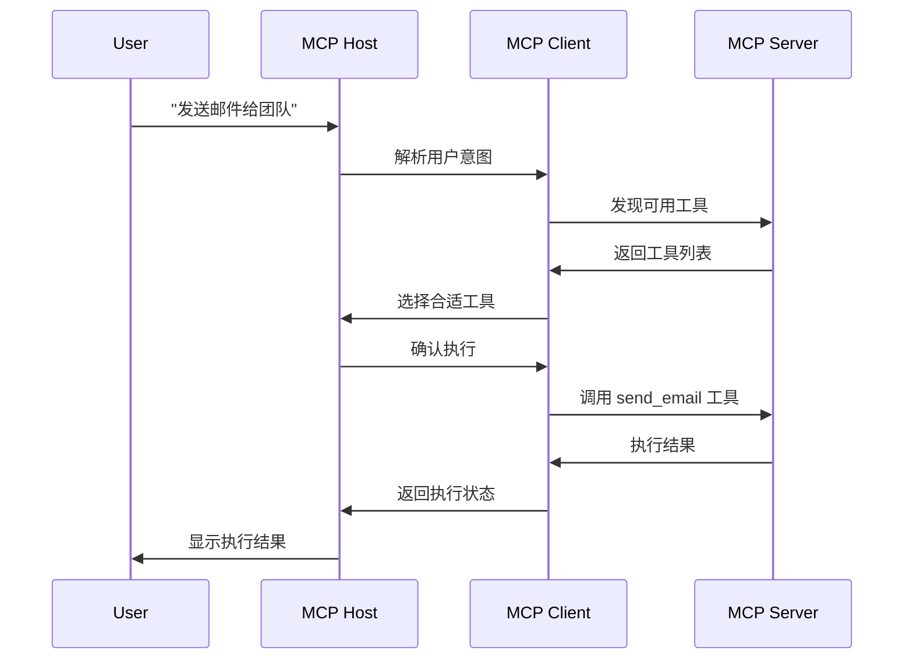

# MCP (Model Context Protocol) 协议概述

## 🎯 什么是 MCP？

Model Context Protocol (MCP) 是一个开放标准，旨在为 AI 模型与外部工具、数据源和服务之间建立安全、标准化的双向连接。

### 核心理念

MCP 就像是 AI 应用程序的 "USB-C 接口"：
- **标准化接口** - 提供统一的协议规范
- **即插即用** - 无需为每个服务单独开发集成
- **双向通信** - AI 既能读取数据，也能执行操作
- **安全可控** - 内置权限控制和安全机制

## 🏗️ MCP 架构

### 核心组件

```
┌─────────────────┐    ┌─────────────────┐    ┌─────────────────┐
│   MCP Client    │◄──►│    MCP Host     │◄──►│   MCP Server    │
│  (AI Assistant) │    │  (ChatGPT/Claude)│    │ (Tool Provider) │
└─────────────────┘    └─────────────────┘    └─────────────────┘
                                ▲
                                │
                       ┌─────────────────┐
                       │   Transport     │
                       │ (stdio/SSE/HTTP)│
                       └─────────────────┘
```

#### 1. MCP Host (主机)
- **定义**: 中央协调器，通常是聊天机器人、IDE 或其他 AI 工具
- **职责**: 管理客户端实例，控制权限和安全策略
- **示例**: Claude Desktop, Cursor IDE, VS Code with Copilot

#### 2. MCP Client (客户端)
- **定义**: 维护与服务器 1:1 连接的协议客户端
- **职责**: 在主机应用内处理与 MCP 服务器的通信
- **功能**: 工具发现、调用和响应处理

#### 3. MCP Server (服务器)
- **定义**: 轻量级程序，暴露特定功能给客户端
- **类型**: 
  - **本地服务器** (stdio): 作为子进程运行
  - **远程服务器** (SSE/HTTP): 通过网络连接
- **提供**: 工具、资源和提示

### 传输层协议

| 协议类型 | 描述 | 适用场景 |
|----------|------|----------|
| **stdio** | 标准输入输出 | 本地开发、桌面应用 |
| **SSE** | 服务器发送事件 | 实时 Web 应用 |
| **HTTP** | 流式 HTTP | 企业级远程服务 |

## 🛠️ MCP 核心概念

### 工具 (Tools)
- **定义**: AI 可以调用的函数，用于执行特定操作
- **功能**: 与 API 交互、文件操作、数据库查询等
- **示例**: 
  ```json
  {
    "name": "send_email",
    "description": "发送邮件给指定收件人",
    "parameters": {
      "to": "收件人邮箱",
      "subject": "邮件主题",
      "body": "邮件正文"
    }
  }
  ```

### 资源 (Resources)
- **定义**: 结构化数据，为 LLM 提供额外上下文
- **类型**: 文件、数据库数据、提交历史等
- **用途**: 增强 AI 的理解和决策能力

### 提示 (Prompts)
- **定义**: 预定义的提示模板
- **作用**: 指导 AI 如何使用特定工具或处理特定场景
- **优势**: 提高响应质量和一致性

## 🔄 工作流程

### 典型的 MCP 交互流程



### 关键步骤说明

1. **工具发现** - 客户端查询服务器可用工具
2. **意图理解** - AI 解析用户自然语言指令
3. **工具选择** - 根据上下文选择合适的工具
4. **参数填充** - 自动或提示用户提供必要参数
5. **安全验证** - 检查权限和安全策略
6. **执行操作** - 调用实际的 API 或服务
7. **结果处理** - 解析和展示执行结果

## 🆚 MCP vs 传统API

| 特性 | 传统API | MCP |
|------|----------|-----|
| **接口设计** | 服务特定 | 统一标准 |
| **集成复杂度** | N×M 集成 | 单一协议 |
| **AI 理解** | 需要文档 | 自描述 |
| **权限控制** | 各自实现 | 标准化 |
| **错误处理** | 不一致 | 统一格式 |
| **发现机制** | 手动配置 | 自动发现 |

## 🌐 MCP 生态系统

### 主要参与者

#### AI 平台
- **Anthropic** - Claude Desktop, Claude.ai
- **OpenAI** - ChatGPT, GPT API
- **Microsoft** - GitHub Copilot, Azure AI
- **Google** - Gemini, Vertex AI

#### 工具提供商
- **Zapier** - 8000+ 应用集成
- **Make.com** - 自定义自动化场景
- **GitHub** - 代码仓库管理
- **Atlassian** - Jira, Confluence

#### 开发平台
- **Cloudflare** - 远程 MCP 服务器托管
- **Cursor** - AI-powered IDE
- **Replit** - 在线开发环境
- **Zed** - 高性能编辑器

## 🚀 MCP 的发展趋势

### 当前状态 (2025年)
- ✅ 基础协议规范已确定
- ✅ 主要 AI 平台开始支持
- ✅ 云端服务商提供托管解决方案
- 🚧 企业级安全功能持续完善
- 🚧 更多垂直领域工具集成中

### 未来展望
- 🔮 **标准化普及** - 成为 AI 工具集成的事实标准
- 🔮 **生态系统成熟** - 丰富的第三方工具和服务
- 🔮 **企业级功能** - 更强的安全、监控和管理能力
- 🔮 **多模态支持** - 支持图像、音频等多媒体内容
- 🔮 **边缘计算** - 支持边缘设备和离线场景

## 💡 选择 MCP 的理由

### 对开发者
- **减少重复工作** - 一次开发，多处使用
- **标准化接口** - 降低学习和维护成本
- **丰富生态** - 利用现有工具和服务
- **未来兼容** - 跟上 AI 发展趋势

### 对企业
- **降低集成成本** - 统一的集成方案
- **提高效率** - AI 驱动的自动化
- **安全可控** - 企业级安全保障
- **灵活扩展** - 根据需求灵活添加功能

### 对最终用户
- **自然交互** - 使用自然语言控制工具
- **统一体验** - 一致的操作界面
- **强大功能** - 访问更多应用和服务
- **个性化** - 根据需求定制工具集

## 📚 延伸阅读

- [MCP 官方规范](https://github.com/modelcontextprotocol)
- [Anthropic MCP 博客](https://www.anthropic.com/news/model-context-protocol)
- [MCP 服务器示例](https://github.com/modelcontextprotocol/servers)
- [Cloudflare MCP 指南](https://developers.cloudflare.com/agents/)

---

*本文档会随着 MCP 协议的发展持续更新。最后更新：2025年6月1日*